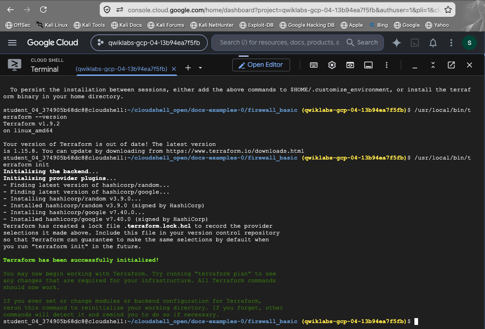
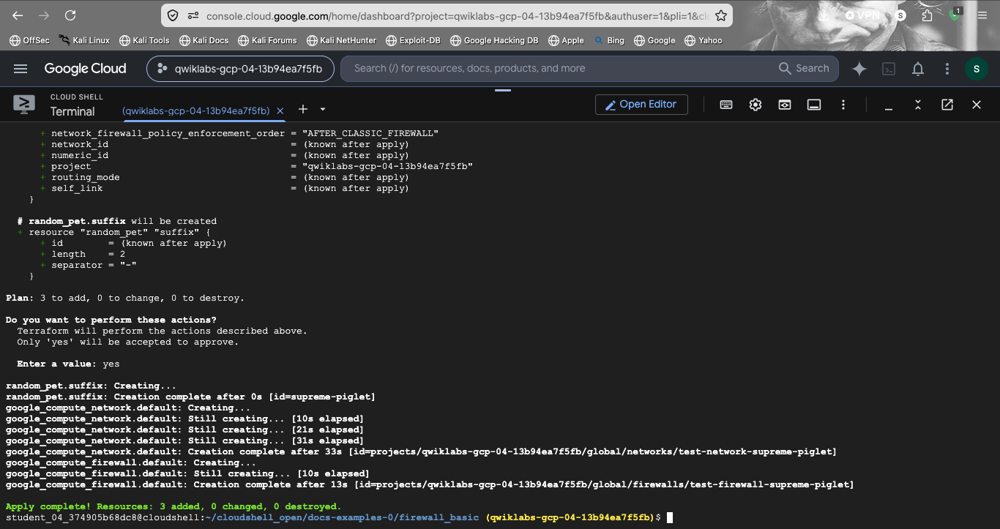
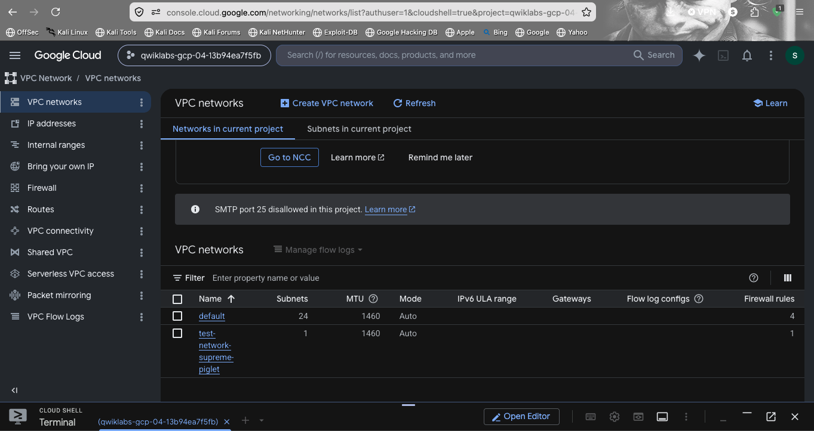
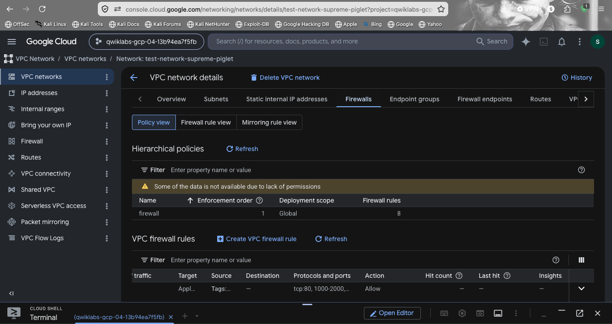

# Automated VPC Architecture & Security Hardening via Terraform (GCP)

## Objective
Designed, deployed, and audited an automated network infrastructure baseline on Google Cloud Platform using Infrastructure as Code (IaC) — enforcing strict network security and preventing configuration drift through version-controlled, repeatable deployments.

## Terraform Initialization
Structured the workspace inside Google Cloud Shell and initialized Terraform, configuring the backend and fetching required provider plugins:

## Deployment
Leveraged a dynamic naming mechanism (`random_pet`) to programmatically deploy a custom, isolated Virtual Private Cloud — avoiding naming collisions and supporting repeatable, automated deployments:

This created an isolated VPC (`test-network-supreme-piglet`) with an accompanying firewall rule, entirely from code.

## Security Hardening
Authored and applied custom VPC firewall rules to restrict traffic to critical vectors — allowing only necessary traffic (tcp:80) rather than defaulting to permissive rules — adhering to the principle of least privilege.

## Verification & Drift Prevention
Cross-referenced the live resources in the GCP Console against the version-controlled Terraform state to confirm architecture alignment and zero configuration drift:
- Confirmed the VPC network existed as defined, alongside the default network
- Verified firewall rules matched exactly what was declared in code (tcp:80, 1000-2000 range, Allow action)

## Skills Demonstrated
- Infrastructure as Code (IaC) with Terraform
- GCP networking (VPC design, firewall rule authorship)
- Principle of least privilege in network security design
- Configuration drift detection and prevention
- Cloud Shell / CLI-driven infrastructure deployment

## Screenshots

**Terraform initialization**

**Terraform apply complete — VPC deployed**

**GCP VPC confirmation**

**GCP firewall verification**

